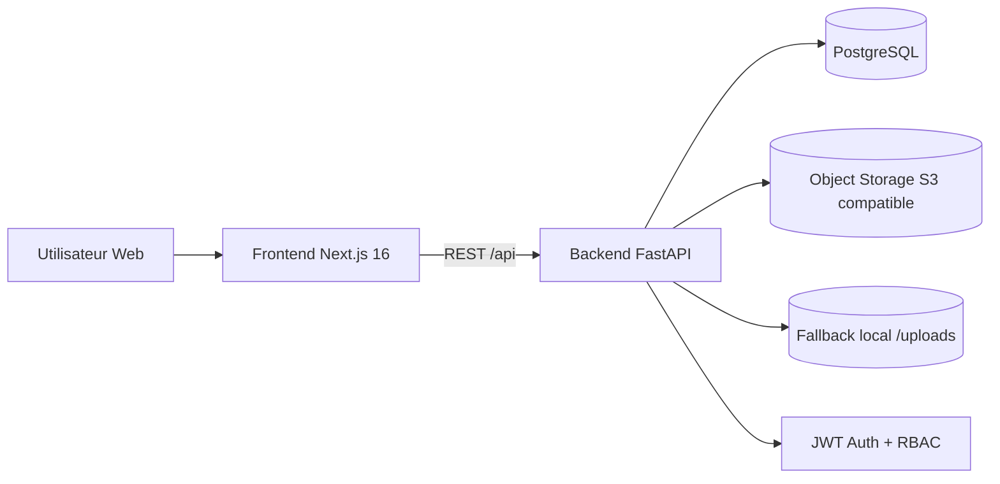
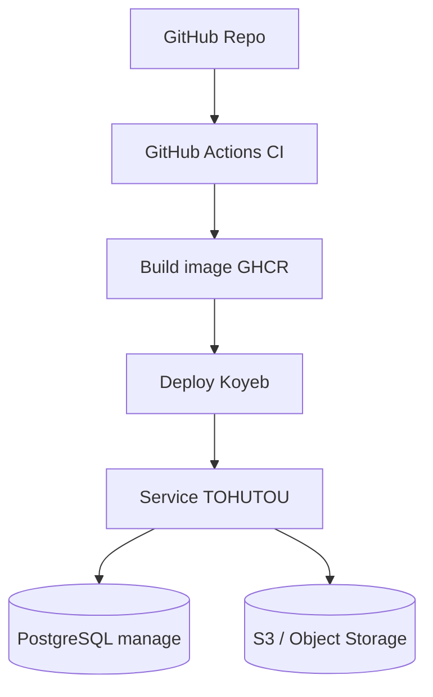

# TOHUTOU - Plateforme ananas (Data DevOps Cloud 2025)

TOHUTOU est une application web de mise en relation dans la filiere ananas:
- publication d'annonces par les producteurs,
- validation par delegue/admin organisation,
- consultation des offres par acheteurs,
- messagerie integree entre acheteur et producteur.

Ce README sert de **documentation centrale** (type DAT) :
- architecture,
- lancement local,
- CI/CD,
- securite,
- acces,
- exemples d'utilisation.

---

## 1) Alignement avec les exigences du programme


| Exigence du programme | Implementation dans ce repo |
|---|---|
| Conteneurisation | `backend/Dockerfile`, `frontend/Dockerfile`, `docker-compose.yml`, Dockerfile racine multi-stage |
| Versioning du code | Depot Git + workflows GitHub Actions |
| CI/CD | `.github/workflows/ci.yml` + `.github/workflows/deploy.yml` |
| DAT (doc architecture technique) | Ce README (architecture, pipeline, choix techniques, acces, schemas, runbook) |

Principe applique: **solution simple, robuste, fonctionnelle, documentee**.

---

## 2) Architecture generale



### Architecture de deploiement (actuelle)



---

## 3) Stack technique et choix

### Backend
- FastAPI (API rapide, schema OpenAPI natif)
- SQLAlchemy Async + asyncpg
- Alembic (migrations)
- Auth JWT (RBAC par role et scope organisation)
- Stockage image: S3 compatible + fallback local

### Frontend
- Next.js 16 + React 19 + TypeScript
- Tailwind CSS v4
- Framer Motion (animations)
- Axios + cookie token

### DevOps
- Docker / Docker Compose
- GitHub Actions (CI + securite + build image)
- Deploy Koyeb via CLI

---

## 4) Fonctionnalites principales

- Authentification:
  - inscription publique: `buyer`, `producer`
  - login JWT
- RBAC:
  - `admin` (super admin global ou admin organisation)
  - `delegate` (scope cooperative)
  - `producer`
  - `buyer`
- Organisation multi-tenant:
  - isolement des donnees par organisation/cooperative
- Annonces:
  - creation, edition, suppression
  - workflow de validation `pending -> approved/rejected`
  - passage en `sold`
- Media:
  - upload image securise
  - proxy image backend pour URLs privees/signature S3
- Notifications + conversations (messagerie)
- Dashboard role-based (admin, delegate, producer)

---

## 5) Structure du projet

```text
TOHUTOU/
|-- backend/
|   |-- app/
|   |   |-- routers/        # Endpoints API
|   |   |-- models/         # Modeles SQLAlchemy
|   |   |-- schemas/        # Schemas Pydantic
|   |   |-- services/       # Auth, storage, notifications
|   |   |-- core/           # Security, dependencies
|   |   `-- scripts/        # Scripts demo (seed/anonymize)
|   |-- alembic.ini
|   |-- pyproject.toml
|   `-- Dockerfile
|-- frontend/
|   |-- src/app/            # Routes Next.js
|   |-- src/components/     # UI + motion
|   |-- src/lib/            # API client, auth context, image helper
|   `-- Dockerfile
|-- .github/workflows/
|   |-- ci.yml
|   `-- deploy.yml
|-- docker-compose.yml
|-- Dockerfile              # image racine fullstack (deploy)
`-- entrypoint.sh
```

---

## 6) Variables d'environnement

Ne commitez jamais vos vraies valeurs. Utilisez vos fichiers locaux:
- `backend/.env`
- `frontend/.env.local`

Initialisation rapide:

```bash
cp backend/.env.example backend/.env
cp frontend/.env.local.example frontend/.env.local
```

### Backend (`backend/.env`)

Variables utilisees par `backend/app/config.py`:

| Variable | Requise | Description |
|---|---|---|
| `DATABASE_URL` | Oui | URL SQLAlchemy async (PostgreSQL) |
| `SECRET_KEY` | Oui | Cle JWT (>= 32 chars) |
| `AES_KEY` | Oui | Cle AES hex (64 chars) |
| `ALGORITHM` | Non | Algo JWT (defaut HS256) |
| `ACCESS_TOKEN_EXPIRE_MINUTES` | Non | Expiration token |
| `CORS_ORIGINS` | Non | Origins autorisees |
| `ADMIN_PHONE` | Non | Super admin seed (si renseigne) |
| `ADMIN_PASSWORD` | Non | Mot de passe super admin seed |
| `ADMIN_FIRST_NAME` | Non | Prenom super admin |
| `ADMIN_LAST_NAME` | Non | Nom super admin |
| `S3_ENDPOINT` | Non | Endpoint object storage |
| `S3_BUCKET` | Non | Bucket media |
| `S3_ACCESS_KEY` | Non | Access key storage |
| `S3_SECRET_KEY` | Non | Secret key storage |
| `S3_REGION` | Non | Region storage |

### Frontend (`frontend/.env.local`)

| Variable | Requise | Description |
|---|---|---|
| `NEXT_PUBLIC_API_URL` | Oui | Base API, ex `http://localhost:8000/api` |

---

## 7) Lancement local (mode dev)

### 7.1 Prerequis
- Python 3.12
- Node.js 22
- `uv` (gestion dependances Python)
- PostgreSQL 16 (local ou conteneur)

### 7.2 Backend

```bash
cd backend
uv sync
uv run alembic upgrade head
uv run uvicorn app.main:app --reload --host 0.0.0.0 --port 8000
```

API disponible sur:
- `http://localhost:8000/api/health`
- `http://localhost:8000/docs`

### 7.3 Frontend

```bash
cd frontend
npm ci
npm run dev
```

Frontend disponible sur:
- `http://localhost:3000`

---

## 8) Lancement avec Docker Compose

```bash
docker compose up --build
```

Services:
- `db` (PostgreSQL)
- `backend` sur `:8000`
- `frontend` sur `:3000`

Compose lit:
- `./backend/.env`
- `./frontend/.env.local`

---

## 9) Donnees demo, noms fictifs et images

Le projet est configure en mode demonstration:
- organisations/cooperatives fictives,
- scripts de seed annonces,
- images ananas (champ/marche) depuis Wikimedia.

### 9.1 Seed auto au demarrage backend

Au boot de l'API (`lifespan`):
- creation super admin si `ADMIN_PHONE` + `ADMIN_PASSWORD` sont renseignes,
- creation des organisations fictives si table vide,
- creation des admins organisation manquants.

### 9.2 Convention login admin organisation (demo)

Generee par le code (`backend/app/main.py`):
- telephone: `01431269XX` (XX index 00, 01, ...)
- mot de passe: `<slug_sans_tiret_ni_espace>2026`

Exemples:
- slug `fenacopab` -> `fenacopab2026`
- slug `ups-benin` -> `upsbenin2026`

> Important: ceci est pour demo locale. En prod: rotation obligatoire.

### 9.3 Scripts utiles

#### Seed annonces demo (avec images)

```bash
cd backend
.venv/bin/python -m app.scripts.seed_demo_announcements --count 14
```

#### Ajouter image aux annonces sans photo

```bash
cd backend
.venv/bin/python -m app.scripts.seed_demo_announcements --count 0 --backfill-missing
```

#### Remplacer anciennes images pexels par images Wikimedia

```bash
cd backend
.venv/bin/python -m app.scripts.seed_demo_announcements --count 0 --replace-pexels
```

#### Anonymiser organisations/cooperatives existantes

```bash
cd backend
.venv/bin/python -m app.scripts.anonymize_demo_entities
```

---

## 10) RBAC et isolation des donnees

### Roles
- `admin`
  - super admin: vue globale (pas d'organisation_id)
  - admin organisation: scope organisation uniquement
- `delegate`: scope cooperative
- `producer`: create/manage ses annonces
- `buyer`: consultation + conversations

### Regles cle
- admin organisation ne voit pas les donnees d'autres organisations.
- delegate ne valide que les annonces de sa cooperative.
- statut annonce initial:
  - `pending` si validateurs disponibles dans l'organisation
  - sinon `approved`

---

## 11) API principale (resume)

Base path: `/api`

- Auth: `/auth/*`
- Users: `/users/*`
- Organizations: `/organizations/*`
- Cooperatives: `/cooperatives/*`
- Announcements: `/announcements/*`
- Upload image: `/upload`, `/upload/proxy`
- Membership requests: `/membership-requests/*`
- Notifications: `/notifications/*`
- Conversations: `/conversations/*`
- Stats: `/stats/*`

Voir details interactifs dans Swagger:
- `http://localhost:8000/docs`

---

## 12) Exemples API (curl)

### 12.1 Login et recuperation token

```bash
TOKEN=$(curl -s -X POST "http://localhost:8000/api/auth/login" \
  -H "Content-Type: application/json" \
  -d '{
    "phone": "0143126900",
    "password": "fenacopab2026"
  }' | jq -r '.access_token')

echo "$TOKEN"
```

### 12.2 Upload image annonce

```bash
curl -X POST "http://localhost:8000/api/upload" \
  -H "Authorization: Bearer $TOKEN" \
  -F "file=@/chemin/vers/photo.jpg"
```

Reponse:

```json
{"url":"https://..."}
```

### 12.3 Creation annonce producteur

```bash
curl -X POST "http://localhost:8000/api/announcements" \
  -H "Authorization: Bearer $TOKEN" \
  -H "Content-Type: application/json" \
  -d '{
    "variety": "Pain de sucre",
    "quantity": 1800,
    "price": 950000,
    "maturity": "Mi-mur",
    "photo_url": "https://upload.wikimedia.org/wikipedia/commons/6/6b/Pineapple_fields_in_Cuba.jpg"
  }'
```

### 12.4 Liste annonces paginees

```bash
curl "http://localhost:8000/api/announcements?page=1&size=12"
```

Avec filtres:

```bash
curl "http://localhost:8000/api/announcements?page=1&size=12&organization_id=1&cooperative_id=2"
```

### 12.5 Validation annonce (delegate/admin)

```bash
curl -X PUT "http://localhost:8000/api/announcements/42/status" \
  -H "Authorization: Bearer $TOKEN" \
  -H "Content-Type: application/json" \
  -d '{"status":"approved"}'
```

---

## 13) Gestion des images (point critique)

Le systeme gere 3 cas:

1. image locale (`/uploads/...`)
2. image S3 privee (URL signee, proxy backend)
3. image externe publique (Wikimedia, etc.)

Le helper frontend `frontend/src/lib/images.ts`:
- proxy les URLs storage (S3/local/signees),
- laisse passer les URLs web externes directes.

Endpoint de proxy:
- `GET /api/upload/proxy?source=<url_encodee>`

---

## 14) CI (GitHub Actions)

Fichier: `.github/workflows/ci.yml`

Jobs executes:
- `backend`:
  - install deps
  - check import app
  - migrations Alembic
- `security-backend`:
  - Bandit
  - pip-audit
- `frontend`:
  - npm ci
  - lint
  - build
- `security-frontend`:
  - npm audit
- `secrets-scan`:
  - Gitleaks
- `docker` (push main):
  - build image Docker

---

## 15) CD (Deploy Koyeb)

Fichier: `.github/workflows/deploy.yml`

Pipeline:
1. build image
2. push GHCR (`ghcr.io/<repo>:latest` + `:<sha>`)
3. deploy update/create service Koyeb

Variables/secrets GitHub attendus:

### Secrets
- `KOYEB_TOKEN`
- `DATABASE_USER`
- `DATABASE_PASSWORD`
- `DATABASE_HOST`
- `DATABASE_NAME`
- `SECRET_KEY`
- `AES_KEY`
- `S3_ENDPOINT`
- `S3_BUCKET`
- `S3_ACCESS_KEY`
- `S3_SECRET_KEY`
- `ADMIN_PHONE`
- `ADMIN_PASSWORD`

### Variables
- `NEXT_PUBLIC_API_URL`
- `CORS_ORIGINS`
- `S3_REGION`

---

## 16) Conteneurisation

### Dockerfiles
- `backend/Dockerfile`: image API FastAPI
- `frontend/Dockerfile`: image Next.js
- `Dockerfile` (racine): image fullstack utilisee en deploy

### Entrypoint deploy

`entrypoint.sh`:
1. applique migrations Alembic
2. lance backend sur `8000`
3. lance frontend sur `3000`
4. termine si un des 2 process tombe

---

## 17) Troubleshooting

### 17.1 Erreur upload S3 "Invalid bucket name"

Cause: `S3_BUCKET` vide/invalide.

Action:
- verifier `backend/.env` (nom de variable, valeur),
- redemarrer backend apres modification.

### 17.2 Images non affichees

Verifier:
- `photo_url` existe en DB,
- URL est reachable,
- helper frontend route bien l'URL (proxy ou direct),
- backend proxy repond: `/api/upload/proxy?...`.

### 17.3 Hydration warning Next.js

Des extensions navigateur peuvent injecter des attributs dans le HTML.
Le layout racine contient `suppressHydrationWarning` pour eviter les faux positifs en dev.

### 17.4 Build Next.js bloque par fonts Google

Dans un environnement sans internet, le build peut echouer sur `next/font`.
Relancer dans un environnement avec acces reseau ou utiliser une police locale.

---

## 18) Checklist demo

1. Lancer backend + frontend.
2. Verifier `GET /api/health` et home `http://localhost:3000`.
3. Login admin organisation demo.
4. Verifier dashboard scope organisation.
5. Creer/valider annonce avec image.
6. Montrer page `/announcements` remplie.
7. Montrer pipeline CI dans GitHub Actions.
8. Montrer schema architecture + explication choix techniques (ce README).

---

## 19) Qualite et securite - resume

- RBAC strict par role + scope org/cooperative
- validations metier a l'inscription
- upload borne (type, taille max)
- audits automatises CI (Bandit, pip-audit, npm audit, Gitleaks)
- migrations Alembic versionnees
- conteneurisation complete

---

## 20) Licence

Ce projet inclut un fichier `LICENSE` (MIT).
